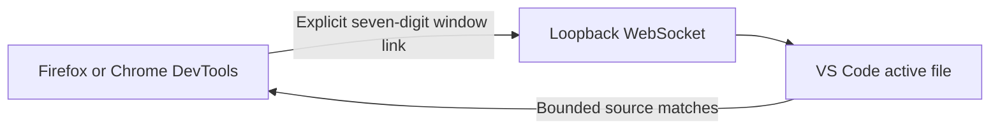

# Pin-op

[](https://github.com/conus-vision/pin-op/actions/workflows/ci.yml)

Select a DOM element in Firefox or Chrome and see matching CSS or
source-mapped SCSS ranges highlighted in the active VS Code file.

Browser DevTools can explain the rendered page, while your editor knows the
source you can actually change. Pin-op keeps those two views synchronized so
you can move from a live element to its source without searching across a
stylesheet by hand.

[Website](https://pin-op.conus.vision) ·
[Documentation](docs/mvp-usage.md) ·
[Issues](https://github.com/conus-vision/pin-op/issues)

> Alpha: product and installation details may change before 1.0.

## See It Work



Pin-op carries bounded inspection facts and source excerpts. Bounded
active-document excerpts cross the bridge and are not content-redacted, so they
may contain sensitive code. Full documents, workspace paths or URIs, source
maps, browser-local DOM references, and executable commands do not cross.

## Quick Start

Once matching browser and VS Code extensions are installed, the normal workflow
is terminal-free:

1. Open your local project in VS Code. Pin-op starts automatically.
2. Click the Pin-op status item to copy that VS Code window's seven-digit link code.
3. Open Pin-op in Firefox or Chrome DevTools, paste the code, and select **Link**.
4. Keep the source document you want to inspect active in VS Code.
5. Select an element with the page picker or the lazy DOM tree.
6. Read the highlighted Selected and Parent ranges in VS Code, or open a bounded
   match from the DevTools **Source** pane.

Each browser window links explicitly to one VS Code window. **Disconnect**
unlinks only the current browser window.

## Who It Is For

- Frontend developers tracing a live component through overlapping CSS rules.
- Teams maintaining large or legacy SCSS codebases with usable source maps.
- IDE and framework authors building additional source resolvers through the
  versioned plugin API.

## What You Get

- An Inspector-like page picker with a box-model overlay and lazy DOM tree.
- Multiple complete CSS or source-mapped SCSS ranges highlighted in the active file.
- Separate Selected and immediate Parent source decorations.
- Bounded Source excerpts with exact navigation back to the IDE.
- Auto Refresh for changed styles and tab reloads with scroll restoration after
  changed script, Vue, PHP, or HTML saves.
- Explicit browser-window linking over a loopback-only WebSocket.

Pin-op is read-only. It does not edit source, execute IDE commands, or switch
the active editor.

## Compatibility

| Capability | Status |
| --- | --- |
| Firefox Stable 142+ | Supported |
| Chrome/Chromium 116+ | Supported with feature parity |
| Local VS Code | Supported; opens projects and starts automatically |
| CSS | Supported in the active document |
| Source-mapped SCSS | Supported with a usable inline or external source map |
| Separately installed source plugins | Supported through the versioned plugin API |
| Remote SSH and WSL extension hosts | Not supported |
| Source editing and reverse sync | Not supported |

## Install Status

The `0.3.0` release is being prepared. Its complete GitHub Release will contain:

- `pin-op-vscode-0.3.0.vsix`;
- `pin-op-chrome-0.3.0.zip`;
- `pin-op-firefox-0.3.0.zip`;
- `pin-op-firefox-0.3.0.xpi`;
- `pin-op-firefox-source-0.3.0.zip`;
- `SHA256SUMS`.

`SHA256SUMS` verifies the five packaged artifacts. The Firefox ZIP is unsigned
Mozilla-review/build input and cannot be installed persistently in Firefox
Stable. No signed `0.3.0` XPI or public `0.3.0` release is claimed yet. Follow
the [installed artifact guide](docs/installed-verification.md) for candidate
installation and current evidence status.

## How It Works

Protocol version `6` is an exact-match WebSocket contract for inspection,
refresh, source presentation, settings, and navigation. Pin-op prefers exact
CSS evidence, uses a conservative unique fingerprint fallback, and fails closed
when source-map or document identity cannot be established safely.

The two-digit PIN prevents accidental local cross-linking; it is not strong
authentication against a hostile same-user process.

Pin-op has no analytics, product HTTP service, or remote backend. Page URLs,
identifiers, permitted attribute values, and CSS facts are bounded but not
content-redacted. Read the [architecture overview](docs/architecture.md),
[protocol contract](docs/protocol.md), [privacy policy](PRIVACY.md),
[security model](docs/security.md), and [security policy](SECURITY.md) before
inspecting sensitive applications.

## Development

Use Node.js 22 and the pinned pnpm version:

```powershell
corepack enable
corepack pnpm install --frozen-lockfile
corepack pnpm build
corepack pnpm test
corepack pnpm test:integration
corepack pnpm typecheck
corepack pnpm lint
```

See [CONTRIBUTING.md](CONTRIBUTING.md) for contributor gates and
[development-host verification](docs/mvp-verification.md) for browser parity.

## Next Steps

Read the [usage guide](docs/mvp-usage.md), report problems in the
[issue tracker](https://github.com/conus-vision/pin-op/issues), and star the
repository if Pin-op shortens your browser-to-source debugging loop.

Pin-op is available under the [MIT License](LICENSE).

Pin-op by Volodymyr Moskvin (c) 2026 [Conus Vision](https://conus.vision)
