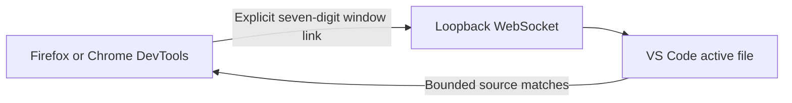

# Pin-op

[](https://github.com/conus-vision/pin-op/actions/workflows/ci.yml)

Select a DOM element in Firefox or Chrome and see matching CSS or
source-mapped SCSS ranges highlighted in the active VS Code file.

Browser DevTools can explain the rendered page, while your editor knows the
source you can actually change. Pin-op keeps those two views synchronized so
you can move from a live element to its source without searching across a
stylesheet by hand.

Chrome and Firefox use one shared Chromium-derived read-only Inspector UI for
the DOM Tree and Rules.

[Website](https://pin-op.conus.vision) ·
[Documentation](docs/mvp-usage.md) ·
[Issues](https://github.com/conus-vision/pin-op/issues)

> Alpha: product and installation details may change before 1.0.

## See It Work


```mermaid
flowchart LR
  Browser[Firefox or Chrome DevTools] -->|Explicit seven-digit window link| Bridge[Loopback WebSocket]
  Bridge --> IDE[VS Code active file]
  IDE -->|Bounded source matches| Browser
```

Pin-op carries bounded inspection facts and source excerpts. Bounded
active-document excerpts cross the bridge and are not content-redacted, so they
may contain sensitive code. Full documents, workspace paths or URIs, source
maps, browser-local DOM references, and executable commands do not cross.
Rules-origin messages add bounded protocol correlation and rule identity plus a
sanitized label, one-based start position, confidence, and opaque open
authority; they do not expose workspace identity.

## Quick Start

Once matching browser and VS Code extensions are installed, the normal workflow
is terminal-free:

1. Open your local project in VS Code. Pin-op starts automatically.
2. Click the Pin-op status item to copy that VS Code window's seven-digit link code.
3. Open Pin-op in Firefox or Chrome DevTools, paste the code, and select **Link**.
4. Keep the source document you want to highlight active in VS Code.
5. Select an element with the page picker or the lazy DOM tree.
6. Inspect the shared Chromium-derived, read-only DOM Tree and Rules UI, then
   use an explicit Rules origin click when you want to open its exact verified
   CSS or source-mapped SCSS block in VS Code.

Each browser window links explicitly to one VS Code window. **Disconnect**
unlinks only the current browser window.

Ordinary/store artifacts default to this Inspector. It is a small BSD-licensed
presentation derivation from a pinned Chromium DevTools revision, backed by
Pin-op's browser-local models rather than either browser's native Inspector
backend. The [pinned source manifest](third_party/chromium-devtools-frontend/UPSTREAM.json),
[BSD license and notices](third_party/chromium-devtools-frontend/LICENSE), and
[Pin-op change record](third_party/chromium-devtools-frontend/PIN_OP_CHANGES.md)
are available in the source tree and Firefox source submission.

## Who It Is For

- Frontend developers tracing a live component through overlapping CSS rules.
- Teams maintaining large or legacy SCSS codebases with usable source maps.
- IDE and framework authors building additional source resolvers through the
  versioned plugin API.

## What You Get

- One shared Chromium-derived read-only Inspector UI in Firefox and Chrome,
  with a page picker, box-model overlay, and lazy DOM tree.
- Multiple complete CSS or source-mapped SCSS ranges highlighted in the active file.
- Read-only inline, matched, inherited, overridden, and unknown Rules, with
  exact CSS/SCSS origins that open only after an explicit origin click.
- An author-style `:hover` and `:focus` preview for supported readable rules;
  this is not native pseudo-state forcing.
- Separate Selected and immediate Parent source decorations.
- In the packaged non-default legacy rollback panel, bounded Source excerpts
  with exact navigation back to the IDE.
- Auto Refresh for changed styles and tab reloads with scroll restoration after
  changed script, Vue, PHP, or HTML saves.
- Explicit browser-window linking over a loopback-only WebSocket.

Pin-op exposes no user-authored CSS or DOM editing operations. It does not edit
source or execute caller-supplied IDE commands. An explicit Rules origin click
may switch VS Code to a verified workspace file using a current IDE-issued
opaque authority; passive inspection never switches editors. No workspace
URI/path, full range, document version, or command crosses the bridge for this
action. Missing or invalid source maps show verified generated CSS only, with
no approximate SCSS origin.

The pseudo-state feature mirrors only supported readable author rules by adding
random, extension-owned marker attributes and temporary styles while the
preview is enabled. It does not call `focus()` or dispatch input, focus, mouse,
pointer, or keyboard events. Page scripts and MutationObservers can observe
these temporary preview artifacts, and the mirrored styles can trigger CSS
transitions, animations, or resource loads. Controlled exits remove the exact
owned artifacts. Abrupt extension termination can leave them in the page until
page navigation or reload.

Known cases are reported as partial or unavailable and are not guessed.
Negated targets such as `:not(:hover)`, ancestor or sibling pseudo targets,
`:has()` targets, and unprovable cascade positions are partial. Inaccessible
stylesheets/scopes and closed shadow roots are unavailable; closed-shadow
internals do not contribute an unsupported pseudo-rule count.

The default Inspector has no visible Source tab. Existing Source remains
active-document-only in the packaged, non-default legacy rollback panel for
exactly one published rollback release. A remounted Source tab and first-party
PHP/template providers remain future scope.

## Compatibility

| Capability | Status |
| --- | --- |
| Firefox Stable 142+ | Supported |
| Chrome/Chromium 116+ | Supported with feature parity |
| Local VS Code | Supported; opens projects and starts automatically |
| CSS | Supported in the active document |
| Source-mapped SCSS | Supported with a usable inline or external source map |
| Separately installed source plugins | Supported through the versioned plugin API |
| Remote SSH and WSL extension hosts | Not supported |
| Source editing and reverse sync | Not supported |

## Install Status

The `0.3.0` release is being prepared. Its complete GitHub Release will contain:

- `pin-op-vscode-0.3.0.vsix`;
- `pin-op-chrome-0.3.0.zip`;
- `pin-op-firefox-0.3.0.zip`;
- `pin-op-firefox-0.3.0.xpi`;
- `pin-op-firefox-source-0.3.0.zip`;
- `SHA256SUMS`.

`SHA256SUMS` verifies the five packaged artifacts. The Firefox ZIP is unsigned
Mozilla-review/build input and cannot be installed persistently in Firefox
Stable. No signed `0.3.0` XPI or public `0.3.0` release is claimed yet. Follow
the [installed artifact guide](docs/installed-verification.md) for candidate
installation and current evidence status.

## How It Works

Protocol version `7` is an exact-match WebSocket contract for inspection,
refresh, source presentation, settings, and Rules navigation. Pin-op prefers exact
CSS evidence, uses a conservative unique fingerprint fallback, and fails closed
when source-map or document identity cannot be established safely.

The two-digit PIN prevents accidental local cross-linking; it is not strong
authentication against a hostile same-user process.

Pin-op has no analytics, product HTTP service, or remote backend. Page URLs,
identifiers, permitted attribute values, and CSS facts are bounded but not
content-redacted. Read the [architecture overview](docs/architecture.md),
[protocol contract](docs/protocol.md), [privacy policy](PRIVACY.md),
[security model](docs/security.md), and [security policy](SECURITY.md) before
inspecting sensitive applications.

## Development

Use Node.js 22 and the pinned pnpm version:

```powershell
corepack enable
corepack pnpm install --frozen-lockfile
corepack pnpm build
corepack pnpm test
corepack pnpm test:integration
corepack pnpm typecheck
corepack pnpm lint
```

See [CONTRIBUTING.md](CONTRIBUTING.md) for contributor gates and
[development-host verification](docs/mvp-verification.md) for browser parity.

## Next Steps

Read the [usage guide](docs/mvp-usage.md), report problems in the
[issue tracker](https://github.com/conus-vision/pin-op/issues), and star the
repository if Pin-op shortens your browser-to-source debugging loop.

Pin-op is available under the [MIT License](LICENSE).

Pin-op by Volodymyr Moskvin (c) 2026 [Conus Vision](https://conus.vision)
