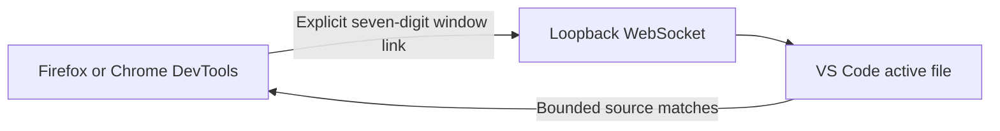

# Pin-op

[](https://github.com/conus-vision/pin-op/actions/workflows/ci.yml)

Select a DOM element in Firefox or Chrome and see matching CSS or
source-mapped SCSS ranges highlighted in the active VS Code file.

You found the rule in DevTools. Now you have to find it again in the editor,
in a stylesheet you did not write, maybe behind a source map. Pin-op does that
step for you: pick the element in the browser, and VS Code highlights the
blocks that style it. Click a declaration in Rules and the editor opens it with
the cursor on the value, ready to edit.

Chrome and Firefox use one shared Chromium-derived read-only Inspector UI for
the DOM Tree and Rules.

[Website](https://pin-op.conus.vision) ·
[Documentation](docs/mvp-usage.md) ·
[Issues](https://github.com/conus-vision/pin-op/issues)

> Alpha: product and installation details may change before 1.0.

## See It Work


```mermaid
flowchart LR
  Browser[Firefox or Chrome DevTools] -->|Explicit seven-digit window link| Bridge[Loopback WebSocket]
  Bridge --> IDE[VS Code active file]
  IDE -->|Bounded source matches| Browser
```

The browser sends VS Code a small description of the element you picked, and
VS Code sends back where that element lives in your source. Bounded
active-document excerpts cross the bridge and are not content-redacted, so they
may contain sensitive code. Full documents, workspace paths or URIs, source
maps, browser-local DOM references, and executable commands do not cross.
Rules-origin messages add bounded protocol correlation and rule identity plus a
sanitized label, one-based start position, confidence, and opaque open
authority; they do not expose workspace identity.

## Quick Start

Once matching browser and VS Code extensions are installed, the normal workflow
is terminal-free:

1. Open your local project in VS Code. Pin-op starts automatically.
2. Click the Pin-op status item to copy that VS Code window's seven-digit link code.
3. Open Pin-op in Firefox or Chrome DevTools, paste the code, and select **Link**.
4. Keep the file you want highlighted active in VS Code.
5. Pick an element on the page or in the lazy DOM tree.
6. Read its rules in the Inspector. An explicit Rules origin click opens the
   exact verified CSS or source-mapped SCSS block in VS Code; clicking a
   declaration puts the cursor on its value; clicking an `@media` size resizes
   the browser window to that size.

Each browser window links to one VS Code window. **Disconnect** unlinks only
the current browser window.

Ordinary/store artifacts default to this Inspector. It is a small BSD-licensed
presentation derivation from a pinned Chromium DevTools revision, backed by
Pin-op's own browser-local models rather than either browser's native Inspector
backend. The [pinned source manifest](third_party/chromium-devtools-frontend/UPSTREAM.json),
[BSD license and notices](third_party/chromium-devtools-frontend/LICENSE), and
[Pin-op change record](third_party/chromium-devtools-frontend/PIN_OP_CHANGES.md)
are in the source tree and the Firefox source submission.

## Who It Is For

- Frontend developers tracing one element through overlapping CSS rules.
- Teams on large or legacy SCSS codebases with usable source maps.
- Developers who want to see which template or script line refers to an
  element, in PHP, JavaScript, TypeScript, JSX, or TSX.
- IDE and framework authors building their own source resolvers on the
  versioned plugin API.

## What You Get

- The same read-only Inspector in Firefox and Chrome, with a page picker, a
  box-model overlay, and a lazy DOM tree.
- Every complete CSS or source-mapped SCSS block that matches, highlighted in
  the active file, with separate Selected and immediate Parent decorations.
- Rules the way the stylesheet wrote them: inline, matched, inherited,
  overridden, and unknown. An origin opens its exact CSS or SCSS block only when
  you click it, and a declaration opens with the cursor on its value.
- A Rules lookup that finds the stylesheet by what it contains, so a dev server,
  a CMS path, or a renamed build output does not hide the source.
- `@media` conditions you can click to see the page at that viewport size.
- An author-style `:hover` and `:focus` preview for supported readable rules.
  It is not native pseudo-state forcing.
- A Source tab with short excerpts from the active file, exact navigation back
  to the IDE, and a link walkthrough whenever no IDE is connected.
- Built-in PHP and JavaScript providers. PHP finds the element in the active
  template, exactly from instrumentation or heuristically from its markup. The
  JavaScript provider lists where the active script names the element:
  selector strings, `getElementById`, `classList` and jQuery class calls,
  `dataset` and attribute calls, JSX opening tags, and markup inside strings.
- Auto Refresh: changed styles are swapped in place, and a changed script, Vue,
  PHP, or HTML file reloads the tab with its scroll position restored.
- Explicit browser-window linking over a loopback-only WebSocket.

Pin-op exposes no user-authored CSS or DOM editing operations. It does not edit
source or execute caller-supplied IDE commands. An explicit Rules origin click
may switch VS Code to a verified workspace file using a current IDE-issued
opaque authority; passive inspection never switches editors. No workspace
URI/path, full range, document version, or command crosses the bridge for this
action. Missing or invalid source maps show verified generated CSS only, with
no approximate SCSS origin.

The pseudo-state preview mirrors only supported readable author rules. While it
is on, it adds random, extension-owned marker attributes and temporary styles.
It does not call `focus()` or dispatch input, focus, mouse, pointer, or keyboard
events. Page scripts and MutationObservers can see these temporary artifacts,
and the mirrored styles can start CSS transitions, animations, or resource
loads. A controlled exit removes exactly what the preview added. Abrupt
extension termination can leave them in the page until page navigation or
reload.

When Pin-op cannot be sure, it says so instead of guessing. Negated targets
such as `:not(:hover)`, ancestor or sibling pseudo targets, `:has()` targets,
and unprovable cascade positions are reported as partial. Inaccessible
stylesheets or scopes and closed shadow roots are unavailable; closed-shadow
internals do not add to the unsupported pseudo-rule count.

Source works on the active document only. The PHP provider uses instrumented
`php.template` or `wordpress.acf-block` facts when a runtime emits them, and
otherwise matches the template's literal markup. The JavaScript provider reads
the active JavaScript, TypeScript, JSX, or TSX file from the literals that name
the element. Both are heuristic without instrumentation. Twig, Blade, and other
template providers remain future scope.

## Compatibility

| Capability | Status |
| --- | --- |
| Firefox Stable 142+ | Supported |
| Chrome/Chromium 116+ | Supported with feature parity |
| Local VS Code | Supported; opens projects and starts automatically |
| IDEs other than VS Code | In development |
| CSS | Supported in the active document |
| Source-mapped SCSS | Supported with a usable inline or external source map |
| PHP templates | Supported in the active document; instrumented, else heuristic |
| JavaScript, TypeScript, JSX, TSX | Supported in the active document; heuristic |
| Separately installed source plugins | Supported through the versioned plugin API |
| Remote SSH and WSL extension hosts | Not supported |
| Source editing and reverse sync | Not supported |

## Install Status

Pin-op has two halves, and neither does anything alone. Install the VS Code
extension and the extension for the browser you inspect in.

- VS Code:
  [Visual Studio Marketplace](https://marketplace.visualstudio.com/items?itemName=conus-vision.pin-op),
  extension ID `conus-vision.pin-op`.
- Chrome and Chromium 116+:
  [Chrome Web Store](https://chromewebstore.google.com/detail/pkfpamadjoolcfkaadnleagmhbapepci).
- Firefox Stable 142+:
  [Firefox Add-ons](https://addons.mozilla.org/addon/pin-op/).

VS Code is the only IDE a browser window can link to. Support for other IDEs is
in development.

The store listings are the normal way to install Pin-op. The release artifacts
below exist for checksum verification and offline installation, and they are
distributed separately from the stores.

The `0.5.0` GitHub Release is being prepared. It will contain:

- `pin-op-vscode-0.5.0.vsix`;
- `pin-op-chrome-0.5.0.zip`;
- `pin-op-firefox-0.5.0.zip`;
- `pin-op-firefox-source-0.5.0.zip`;
- `SHA256SUMS`.

`SHA256SUMS` verifies the four packaged artifacts. The Firefox ZIP is unsigned
Mozilla-review/build input and cannot be installed persistently in Firefox
Stable. Firefox Add-ons serves the signed build instead. No public `0.5.0` GitHub
Release is claimed yet. The
[installed artifact guide](docs/installed-verification.md) covers candidate
installation and the current evidence status.

Once Firefox Add-ons has signed `0.5.0`, the release also carries
`pin-op-firefox-0.5.0.xpi`, the file Mozilla signed for the listing, with
`pin-op-firefox-0.5.0.xpi.sha256`. Before it is attached, the release checks it
against `pin-op-firefox-0.5.0.zip` file by file.

### Install from a GitHub release

Download the files for your browser and the VS Code extension from the same
release, and check them against `SHA256SUMS`.

- VS Code: run **Extensions: Install from VSIX...** from the Command Palette
  and select `pin-op-vscode-0.5.0.vsix`.
- Chrome or Chromium: extract `pin-op-chrome-0.5.0.zip` into a folder you keep,
  open `chrome://extensions`, turn on **Developer mode**, choose **Load
  unpacked**, and select that folder. Chrome does not update an unpacked
  extension; install the next release the same way.
- Firefox: open `pin-op-firefox-0.5.0.xpi` in Firefox (drag it onto a window,
  or use **Install Add-on From File** in `about:addons`). Firefox checks
  Mozilla's signature and keeps the add-on across restarts. A release without
  an `.xpi` has not been signed yet; install from Firefox Add-ons instead.

## How It Works

Protocol version `7` is an exact-match WebSocket contract for inspection,
refresh, source presentation, settings, and Rules navigation. Pin-op prefers
exact CSS evidence, falls back to a conservative unique fingerprint, and stops
when a source map or document identity cannot be established safely.

The two-digit PIN prevents accidental local cross-linking; it is not strong
authentication against a hostile same-user process.

Pin-op has no analytics, product HTTP service, or remote backend. Page URLs,
identifiers, permitted attribute values, and CSS facts are bounded but not
content-redacted. Before inspecting a sensitive application, read the
[architecture overview](docs/architecture.md),
[protocol contract](docs/protocol.md), [privacy policy](PRIVACY.md),
[security model](docs/security.md), and [security policy](SECURITY.md).

## Development

Use Node.js 22 and the pinned pnpm version:

```powershell
corepack enable
corepack pnpm install --frozen-lockfile
corepack pnpm build
corepack pnpm test
corepack pnpm test:integration
corepack pnpm typecheck
corepack pnpm lint
```

[CONTRIBUTING.md](CONTRIBUTING.md) lists the contributor gates, and
[development-host verification](docs/mvp-verification.md) covers browser
parity.

## Next Steps

Read the [usage guide](docs/mvp-usage.md) and report problems in the
[issue tracker](https://github.com/conus-vision/pin-op/issues). If Pin-op saves
you a search through a stylesheet, a star on the repository helps other
developers find it.

Pin-op is available under the [MIT License](LICENSE).

Pin-op by Volodymyr Moskvin (c) 2026 [Conus Vision](https://conus.vision)
