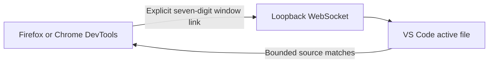

# Link Onboarding And Listings Implementation Plan

> **For agentic workers:** REQUIRED SUB-SKILL: Use superpowers:subagent-driven-development (recommended) or superpowers:executing-plans to implement this plan task-by-task. Steps use checkbox (`- [ ]`) syntax for tracking.

**Goal:** Replace the unlinked Inspector shell with a focused link onboarding screen, then publish clear English GitHub and extension-store descriptions with consistent attribution.

**Architecture:** Keep link ownership and protocol behavior in `PanelController`; expose presentation intent through its existing `showLinkControls` and `showDisconnect` fields. `DomPanelView` owns visibility of onboarding versus operational UI, while shared HTML/CSS remains the single Firefox/Chrome surface. Documentation and package metadata use one canonical short description, with tested long-form listing copy in Markdown.

**Tech Stack:** TypeScript, Vitest, WebExtension HTML/CSS, Node test runner, Markdown, pnpm, web-ext, VS Code VSIX tooling.

---

## File Map

- `packages/browser-extension-core/src/panelController.ts`: Link button enabled/busy semantics.
- `packages/browser-extension-core/src/panelView.ts`: Authoritative link-mode visibility.
- `packages/browser-extension-core/assets/panel.html`: Onboarding and operational-footer structure.
- `packages/browser-extension-core/assets/panel.css`: Primary Link styling and responsive onboarding layout.
- `packages/browser-extension-core/test/panelController.test.ts`: Link action behavior.
- `packages/browser-extension-core/test/panelRuntime.test.ts`: Runtime transitions between link and linked modes.
- `packages/browser-extension-core/test/panelAssets.test.ts`: Packaged markup and CSS contract.
- `README.md`: GitHub landing README.
- `extensions/vscode/README.md`: VS Code Marketplace long description.
- `docs/store-listings.md`: GitHub About, AMO, and Chrome Web Store publication copy.
- `package.json`, `extensions/vscode/package.json`, `extensions/firefox/manifest.json`, `extensions/chrome/manifest.json`: Canonical short metadata.
- `tools/vscode-extension-identity.mjs`, `tools/verify-artifacts.mjs`: Release identity enforcement.
- `tools/test/package-identity.test.mjs`, `tools/test/store-listings.test.mjs`, and manifest/package smoke tests: Copy and artifact regressions.

### Task 1: Keep Link Available Before Validation

**Files:**
- Modify: `packages/browser-extension-core/test/panelController.test.ts`
- Modify: `packages/browser-extension-core/src/panelController.ts`

- [ ] **Step 1: Write the failing idle-button test**

Add this test near the existing manual-entry validation test:

```ts
it("keeps Link available before a code is entered", async () => {
  const harness = createHarness();

  await harness.controller.initialize();

  expect(harness.view.current).toMatchObject({
    state: "notLinked",
    showLinkControls: true,
    linkButtonDisabled: false,
  });

  await harness.view.actions.onLink();

  expect(harness.sent).toEqual([]);
  expect(harness.view.current).toMatchObject({
    state: "error",
    errorText: "Enter a valid seven-digit code",
    linkButtonDisabled: false,
  });
});
```

- [ ] **Step 2: Run the focused test and confirm RED**

Run:

```powershell
corepack pnpm --filter @pin-op/browser-extension-core exec vitest run test/panelController.test.ts -t "keeps Link available before a code is entered"
```

Expected: FAIL because `linkButtonDisabled` is currently `true` for an empty code.

- [ ] **Step 3: Implement busy-only disabling**

In `PanelController.render()`, remove the unused validity calculation and publish:

```ts
linkButtonDisabled: this.busy,
```

Keep validation inside `link()` unchanged so empty and malformed submissions remain local and send no bridge message.

- [ ] **Step 4: Run the controller suite and confirm GREEN**

Run:

```powershell
corepack pnpm --filter @pin-op/browser-extension-core exec vitest run test/panelController.test.ts
```

Expected: all PanelController tests PASS.

- [ ] **Step 5: Commit the behavior**

```powershell
git add packages/browser-extension-core/src/panelController.ts packages/browser-extension-core/test/panelController.test.ts
git commit -m "feat(panel): keep Link action available"
```

### Task 2: Add The State-Driven Onboarding Surface

**Files:**
- Modify: `packages/browser-extension-core/test/panelAssets.test.ts`
- Modify: `packages/browser-extension-core/test/panelRuntime.test.ts`
- Modify: `packages/browser-extension-core/assets/panel.html`
- Modify: `packages/browser-extension-core/assets/panel.css`
- Modify: `packages/browser-extension-core/src/panelView.ts`

- [ ] **Step 1: Write failing asset-contract tests**

Extend the first `panelAssets.test.ts` test to require unique IDs for
`toolbar-features`, `link-onboarding`, and `operational-footer`. Add a separate
test with these assertions:

```ts
it("ships a focused unlinked onboarding surface", () => {
  expect(openingTag("link-onboarding")).toMatch(/hidden/);
  expect(html).toContain("Connect Pin-op to VS Code");
  expect(html).toContain(
    "click the Pin-op status item to copy its seven-digit link code",
  );
  expect(html).toContain(
    "Pin-op reveals the related ranges in the active IDE file",
  );
  expect(css).toMatch(
    /\.primary-button\s*\{[^}]*color:\s*#fff;[^}]*background:\s*var\(--primary-action\);/s,
  );
  expect(css).toMatch(
    /\.link-onboarding\s*\{[^}]*grid-area:\s*workspace;[^}]*place-items:\s*center;/s,
  );
});
```

- [ ] **Step 2: Write failing runtime transition tests**

Add one test to `panelRuntime.test.ts` for initial link mode:

```ts
it("shows only link onboarding before this browser window is linked", async () => {
  const runtime = createRuntime();
  await runtime.ready;

  expect(dom.element("toolbar-features").hidden).toBe(true);
  expect(dom.element("link-onboarding").hidden).toBe(false);
  expect(dom.element("panel-workspace").hidden).toBe(true);
  expect(dom.element("operational-footer").hidden).toBe(true);
  expect(dom.element("link-controls").hidden).toBe(false);
  expect(dom.element("link-button").disabled).toBe(false);

  runtime.dispose();
});
```

Add a second test that emits a linked window state and then an authoritative
`notLinked` state:

```ts
it("restores the Inspector shell only while link intent is retained", async () => {
  const runtime = createRuntime();
  await runtime.ready;
  const port = requiredPort(ports, 0);

  port.emitMessage({
    type: "pin-op.windowState",
    state: "linked",
    displayLinkCode: "48735 07",
  });
  await flushAsync();

  expect(dom.element("toolbar-features").hidden).toBe(false);
  expect(dom.element("link-onboarding").hidden).toBe(true);
  expect(dom.element("panel-workspace").hidden).toBe(false);
  expect(dom.element("operational-footer").hidden).toBe(false);
  expect(dom.element("disconnect-button").hidden).toBe(false);

  port.emitMessage({ type: "pin-op.windowState", state: "notLinked" });
  await flushAsync();

  expect(dom.element("toolbar-features").hidden).toBe(true);
  expect(dom.element("link-onboarding").hidden).toBe(false);
  expect(dom.element("panel-workspace").hidden).toBe(true);

  runtime.dispose();
});
```

- [ ] **Step 3: Run the tests and confirm RED**

Run:

```powershell
corepack pnpm --filter @pin-op/browser-extension-core exec vitest run test/panelAssets.test.ts test/panelRuntime.test.ts
```

Expected: FAIL because the onboarding nodes and visibility behavior do not yet exist.

- [ ] **Step 4: Add semantic onboarding markup**

In `panel.html`:

1. Add `id="toolbar-features"` to the existing feature-control container.
2. Insert this section after the protocol warning and before `panel-workspace`:

```html
<section id="link-onboarding" class="link-onboarding" aria-labelledby="link-onboarding-title" hidden>
  <div class="link-onboarding-content">
    <h1 id="link-onboarding-title">Connect Pin-op to VS Code</h1>
    <p>Open your project in VS Code and click the Pin-op status item to copy its seven-digit link code. Paste it above and choose Link.</p>
    <p>After linking, select a DOM element in the tree or on the page. Pin-op reveals the related ranges in the active IDE file.</p>
  </div>
</section>
```

3. Wrap `selected-element-summary` and `resolution-row` in:

```html
<div id="operational-footer" class="operational-footer">
  <!-- existing selected summary and resolution row -->
</div>
```

Keep `panel-error` outside this wrapper so validation errors remain visible in link mode. Keep `panel-branding` unchanged.

- [ ] **Step 5: Implement authoritative view visibility**

In `DomPanelView`, add required fields for `toolbar-features`,
`link-onboarding`, and `operational-footer`. At the end of `render()` derive
link mode only from the model:

```ts
const linkMode = model.showLinkControls;
this.toolbarFeatures.hidden = linkMode;
this.linkOnboarding.hidden = !linkMode;
this.workspace.hidden = linkMode;
this.operationalFooter.hidden = linkMode;
```

Do not infer state from text, CSS, or the connection code.

- [ ] **Step 6: Style the primary action and onboarding**

Add theme tokens and rules to `panel.css`:

```css
:root {
  --primary-action: #0969da;
  --primary-action-hover: #075bbd;
}

.primary-button {
  min-width: 52px;
  padding: 4px 10px;
  border-color: var(--primary-action);
  color: #fff;
  background: var(--primary-action);
}

.primary-button:hover:not(:disabled) {
  border-color: var(--primary-action-hover);
  background: var(--primary-action-hover);
}

.link-onboarding {
  grid-area: workspace;
  display: grid;
  min-width: 0;
  min-height: 0;
  padding: 20px;
  overflow: auto;
  place-items: center;
}

.link-onboarding-content {
  width: min(100%, 520px);
}

.link-onboarding h1 {
  margin: 0 0 10px;
  font-size: 18px;
  letter-spacing: 0;
}

.link-onboarding p {
  margin: 0 0 8px;
  line-height: 1.5;
}

.operational-footer {
  display: grid;
  min-width: 0;
  gap: 2px;
}
```

Add `link-onboarding` to `.panel-layout`'s workspace grid area without adding a
new row. Preserve `[hidden] { display: none !important; }`.

- [ ] **Step 7: Run shared and browser contract tests**

Run:

```powershell
corepack pnpm --filter @pin-op/browser-extension-core exec vitest run test/panelAssets.test.ts test/panelController.test.ts test/panelRuntime.test.ts test/panelLayoutController.test.ts
corepack pnpm --filter pin-op-firefox exec vitest run test/panelAssets.test.ts
corepack pnpm --filter pin-op-chrome exec vitest run test/panelAssets.test.ts
```

Expected: all tests PASS and both emitted packages preserve the shared panel.

- [ ] **Step 8: Commit the onboarding UI**

```powershell
git add packages/browser-extension-core/assets/panel.html packages/browser-extension-core/assets/panel.css packages/browser-extension-core/src/panelView.ts packages/browser-extension-core/test/panelAssets.test.ts packages/browser-extension-core/test/panelRuntime.test.ts
git commit -m "feat(panel): add link onboarding"
```

### Task 3: Rewrite GitHub And Extension Listings

**Files:**
- Create: `docs/store-listings.md`
- Create: `tools/test/store-listings.test.mjs`
- Modify: `README.md`
- Modify: `extensions/vscode/README.md`
- Modify: `package.json`
- Modify: `extensions/vscode/package.json`
- Modify: `extensions/firefox/manifest.json`
- Modify: `extensions/chrome/manifest.json`
- Modify: `tools/vscode-extension-identity.mjs`
- Modify: `tools/verify-artifacts.mjs`
- Modify: `tools/test/package-identity.test.mjs`
- Modify: `tools/test/installed-verification-doc.test.mjs`
- Modify: `tools/test/packaged-vscode-smoke.test.mjs`
- Modify: `tools/test/packaged-chrome-smoke.test.mjs`
- Modify: `extensions/vscode/test/manifest.test.ts`
- Modify: `extensions/firefox/test/manifest.test.ts`
- Modify: `extensions/chrome/test/manifest.test.ts`

- [ ] **Step 1: Add failing canonical-copy tests**

Use this exact shared expectation wherever product metadata is asserted:

```js
const productDescription =
  "Highlights styles and source code in your IDE for the selected DOM element. Pin-op by Volodymyr Moskvin. (c) 2026 Conus Vision.";
```

In `package-identity.test.mjs`, also assert:

```js
assert.ok(productDescription.length <= 132);
```

Create `tools/test/store-listings.test.mjs` to read `README.md`,
`extensions/vscode/README.md`, and `docs/store-listings.md`, then assert:

```js
const attribution =
  "Pin-op by Volodymyr Moskvin (c) 2026 [Conus Vision](https://conus.vision)";

assert.ok(rootReadme.trimEnd().endsWith(attribution));
assert.ok(vscodeReadme.trimEnd().endsWith(attribution));
assert.match(storeListings, /## Firefox AMO/);
assert.match(storeListings, /## Chrome Web Store/);
assert.match(storeListings, /## GitHub About/);
assert.equal(storeListings.match(new RegExp(escapeRegExp(attribution), "g"))?.length, 2);
```

Also require the root README to contain `## Quick Start`, `## Who It Is For`, a
Mermaid diagram, the installed workflow, and explicit alpha/release caveats.

- [ ] **Step 2: Run copy tests and confirm RED**

Run:

```powershell
node --test tools/test/package-identity.test.mjs tools/test/store-listings.test.mjs tools/test/packaged-vscode-smoke.test.mjs
corepack pnpm --filter pin-op exec vitest run test/manifest.test.ts
corepack pnpm --filter pin-op-firefox exec vitest run test/manifest.test.ts
corepack pnpm --filter pin-op-chrome exec vitest run test/manifest.test.ts
```

Expected: FAIL on the old description and missing listing document.

- [ ] **Step 3: Update canonical metadata**

Replace the old product description with the exact 127-character string in all
four public manifests and every release verifier/test named in this task. Do not
change IDs, permissions, URLs, versions, or protocol metadata.

- [ ] **Step 4: Write the GitHub landing README**

Write the README with this exact narrative and section order. Keep the existing
CI badge URL, public product links, compatibility values, six artifact names,
development commands, and documentation links:

````markdown
# Pin-op

[](https://github.com/conus-vision/pin-op/actions/workflows/ci.yml)

Select a DOM element in Firefox or Chrome and see every related CSS or
source-mapped SCSS range highlighted in the active VS Code file.

Browser DevTools can explain the rendered page, while your editor knows the
source you can actually change. Pin-op keeps those two views synchronized so
you can move from a live element to its source without searching across a
stylesheet by hand.

[Website](https://pin-op.conus.vision) ·
[Documentation](docs/mvp-usage.md) ·
[Issues](https://github.com/conus-vision/pin-op/issues)

> Alpha: product and installation details may change before 1.0.

## See It Work



Pin-op carries bounded inspection facts and source excerpts. Browser-local DOM
references, workspace contents, and executable commands never cross the bridge.

## Quick Start

Once matching browser and VS Code extensions are installed, the normal workflow
is terminal-free and takes about five minutes:

1. Open your local project in VS Code. Pin-op starts automatically.
2. Click the Pin-op status item to copy that VS Code window's seven-digit link code.
3. Open Pin-op in Firefox or Chrome DevTools, paste the code, and select **Link**.
4. Keep the source document you want to inspect active in VS Code.
5. Select an element with the page picker or the lazy DOM tree.
6. Read the highlighted Selected and Parent ranges in VS Code, or open a bounded
   match from the DevTools **Source** pane.

Each browser window links explicitly to one VS Code window. **Disconnect**
unlinks only the current browser window.

## Who It Is For

- Frontend developers tracing a live component through overlapping CSS rules.
- Teams maintaining large or legacy SCSS codebases with usable source maps.
- IDE and framework authors building additional source resolvers through the
  versioned plugin API.

## What You Get

- An Inspector-like page picker with a box-model overlay and lazy DOM tree.
- Multiple complete CSS or source-mapped SCSS ranges highlighted in the active file.
- Separate Selected and immediate Parent source decorations.
- Bounded Source excerpts with exact navigation back to the IDE.
- Auto Refresh for changed styles and tab reloads with scroll restoration after
  changed script, Vue, PHP, or HTML saves.
- Explicit browser-window linking over a loopback-only WebSocket.

Pin-op is read-only. It does not edit source, execute IDE commands, or switch
the active editor.

## Compatibility

| Capability | Status |
| --- | --- |
| Firefox Stable 142+ | Supported |
| Chrome/Chromium 116+ | Supported with feature parity |
| Local VS Code | Supported; opens projects and starts automatically |
| CSS | Supported in the active document |
| Source-mapped SCSS | Supported with a usable inline or external source map |
| Separately installed source plugins | Supported through the versioned plugin API |
| Remote SSH and WSL extension hosts | Not supported |
| Source editing and reverse sync | Not supported |

## Install Status

The `0.3.0` release is being prepared. Its complete GitHub Release will contain
the VSIX, Chrome ZIP, unsigned Firefox review ZIP, Mozilla-signed XPI, Firefox
source archive, and `SHA256SUMS`. No signed `0.3.0` XPI or public `0.3.0` release
is claimed yet. Follow the [installed artifact guide](docs/installed-verification.md)
for candidate installation and current evidence status.

## How It Works

Protocol version `6` is an exact-match WebSocket contract for inspection,
refresh, source presentation, settings, and navigation. Pin-op prefers exact
CSS evidence, uses a conservative unique fingerprint fallback, and fails closed
when source-map or document identity cannot be established safely.

Pin-op has no analytics, product HTTP service, or remote backend. Page URLs,
identifiers, permitted attribute values, and CSS facts are bounded but not
content-redacted. Read the [architecture overview](docs/architecture.md),
[protocol contract](docs/protocol.md), [privacy policy](PRIVACY.md), and
[security model](docs/security.md) before inspecting sensitive applications.

## Development

Use Node.js 22 and the pinned pnpm version:

```powershell
corepack enable
corepack pnpm install --frozen-lockfile
corepack pnpm build
corepack pnpm test
corepack pnpm test:integration
corepack pnpm typecheck
corepack pnpm lint
```

See [CONTRIBUTING.md](CONTRIBUTING.md) for contributor gates and
[development-host verification](docs/mvp-verification.md) for browser parity.

## Next Steps

Read the [usage guide](docs/mvp-usage.md), report problems in the
[issue tracker](https://github.com/conus-vision/pin-op/issues), and star the
repository if Pin-op shortens your browser-to-source debugging loop.

Pin-op is available under the [MIT License](LICENSE).

Pin-op by Volodymyr Moskvin (c) 2026 [Conus Vision](https://conus.vision)
````

- [ ] **Step 5: Write Marketplace and browser-store copy**

Rewrite `extensions/vscode/README.md` with the same opening result statement,
then sections named `Install From VSIX`, `Link And Inspect`, `What Pin-op
Resolves`, `Safety And Compatibility`, and `Documentation`. Retain the current
terminal-free seven-step workflow and exact protocol-v6 recovery facts. End the
file with the exact attribution line and do not put any content after it.

Create `docs/store-listings.md` with:

```markdown
# Store Listings

## GitHub About
Select a DOM element in Firefox or Chrome and reveal its CSS/SCSS source instantly in VS Code.

## Firefox AMO
Pin-op connects one Firefox window to one local VS Code window through an
explicit seven-digit code. Select an element on the page or in the lazy DOM
tree, then see the related CSS or source-mapped SCSS ranges highlighted in the
active IDE file. The DevTools Source pane also shows bounded excerpts that open
the exact current range in VS Code.

Pin-op distinguishes rules for the selected element from rules for its
immediate parent. Auto Refresh updates eligible styles without reloading the
page and reloads the current tab with scroll restoration after changed script,
Vue, PHP, or HTML saves.

The connection uses a loopback-only WebSocket and explicit browser-window
linking. Pin-op is read-only: it does not edit source, execute IDE commands, or
send product data to a remote Pin-op service. Firefox 142 or newer and the
matching Pin-op VS Code extension are required.

Pin-op by Volodymyr Moskvin (c) 2026 [Conus Vision](https://conus.vision)

## Chrome Web Store
Pin-op connects one Chrome or Chromium window to one local VS Code window
through an explicit seven-digit code. Select an element on the page or in the
lazy DOM tree, then see the related CSS or source-mapped SCSS ranges highlighted
in the active IDE file. The DevTools Source pane also shows bounded excerpts
that open the exact current range in VS Code.

Pin-op distinguishes rules for the selected element from rules for its
immediate parent. Auto Refresh updates eligible styles without reloading the
page and reloads the current tab with scroll restoration after changed script,
Vue, PHP, or HTML saves.

The connection uses a loopback-only WebSocket and explicit browser-window
linking. Pin-op is read-only: it does not edit source, execute IDE commands, or
send product data to a remote Pin-op service. Chrome/Chromium 116 or newer and
the matching Pin-op VS Code extension are required.

Pin-op by Volodymyr Moskvin (c) 2026 [Conus Vision](https://conus.vision)
```

Do not claim source editing, remote transport, automatic window association,
cross-origin DOM traversal, or a signed/public artifact that does not exist.

- [ ] **Step 6: Run copy, identity, and package tests**

Run:

```powershell
node --test tools/test/package-identity.test.mjs tools/test/store-listings.test.mjs tools/test/installed-verification-doc.test.mjs tools/test/packaged-vscode-smoke.test.mjs tools/test/packaged-chrome-smoke.test.mjs
corepack pnpm --filter pin-op exec vitest run test/manifest.test.ts
corepack pnpm --filter pin-op-firefox exec vitest run test/manifest.test.ts
corepack pnpm --filter pin-op-chrome exec vitest run test/manifest.test.ts
```

Expected: all tests PASS.

- [ ] **Step 7: Commit public copy**

```powershell
git add README.md extensions/vscode/README.md docs/store-listings.md package.json extensions/vscode/package.json extensions/firefox/manifest.json extensions/chrome/manifest.json tools/vscode-extension-identity.mjs tools/verify-artifacts.mjs tools/test/package-identity.test.mjs tools/test/store-listings.test.mjs tools/test/installed-verification-doc.test.mjs tools/test/packaged-vscode-smoke.test.mjs tools/test/packaged-chrome-smoke.test.mjs extensions/vscode/test/manifest.test.ts extensions/firefox/test/manifest.test.ts extensions/chrome/test/manifest.test.ts
git commit -m "docs: reshape product and store listings"
```

### Task 4: Visual, Full-Gate, And Package Verification

**Files:**
- Verify only unless a failing test reveals a scoped correction.
- Generated: `artifacts/pin-op-vscode-0.3.0.vsix`
- Generated: `artifacts/pin-op-firefox-0.3.0.zip`
- Generated: `artifacts/pin-op-chrome-0.3.0.zip`
- Generated: `artifacts/pin-op-firefox-source-0.3.0.zip`
- Generated: `artifacts/SHA256SUMS`

- [ ] **Step 1: Run a visual layout harness**

Render the shared panel in headless Chrome at these viewports and inspect the
screenshots:

```text
2400x900: split DOM/Source, compact footer, left unlinked form
900x1800: stack or tabs according to the existing layout controller
900x520: tabs with readable onboarding and no overlapping toolbar text
```

Confirm link mode hides picker/settings/operational panes, Link is visibly blue,
and linked mode preserves the current right-side code and Disconnect controls.
Delete temporary harnesses and profiles after inspection.

- [ ] **Step 2: Run the full repository gate**

Run:

```powershell
corepack pnpm build
corepack pnpm test
corepack pnpm typecheck
corepack pnpm lint
corepack pnpm dlx web-ext@10.4.0 lint --source-dir extensions/firefox --ignore-files package.json pnpm-lock.yaml tsconfig.json esbuild.mjs "src/**" "test/**"
git diff --check
```

Expected: every command exits `0`; web-ext reports zero errors, warnings, and notices.

- [ ] **Step 3: Build and smoke-test release artifacts**

Run:

```powershell
corepack pnpm package
corepack pnpm smoke:chrome-package
corepack pnpm smoke:vscode-package
```

Expected: all four packages verify, checksums are regenerated, Chrome reports
`PACKAGED_CHROME_MV3_OK`, and VS Code reports `INSTALLED_VSIX_ACTIVATION_OK`.

- [ ] **Step 4: Review repository state**

Run:

```powershell
git status --short
git log -4 --oneline
```

Expected: only pre-existing user-owned untracked paths remain; no generated or
temporary test files are staged.
